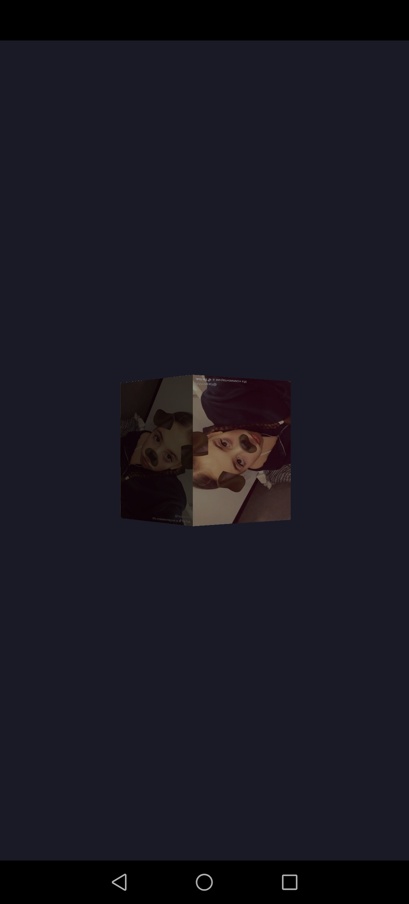

# Pydroid-3D

Лёгкий 3D-движок для Android (Pydroid3) на OpenGL ES 2.0.

## Возможности
- Загрузка OBJ с текстурами и нормалями
- Камера от 1-го лица (pitch/yaw)
- Коллизии (AABB)
- Текстуры (PNG через Pillow)
- Frame Buffer Objects (FBO) рендеринг всей сцены в текстуру для создания зеркал, камер наблюдения или пост-эффектов.
- Frame Buffer Objects (FBO): рендеринг всей сцены в текстуру для создания зеркал, камер наблюдения или пост-эффектов.
- GUI System: отрисовка 2D-интерфейса поверх 3D сцен
- Сохранение fbo в png файл.

## Установка в Pydroid3
1. Установите `pydroid permissions plugin`
2. Установите пакеты: `pip install pysdl2 pillow numpy`
3. Скопируйте репозиторий
4. Установите модуль: `python build.py`
5. Запустите `example.py`

## Пример
```python
from engine_core import *
core = Engine()
box = core.load_obj("box.obj")
while True:
    box.angle += 0.02
    core.draw(box)
    core.main()
```
